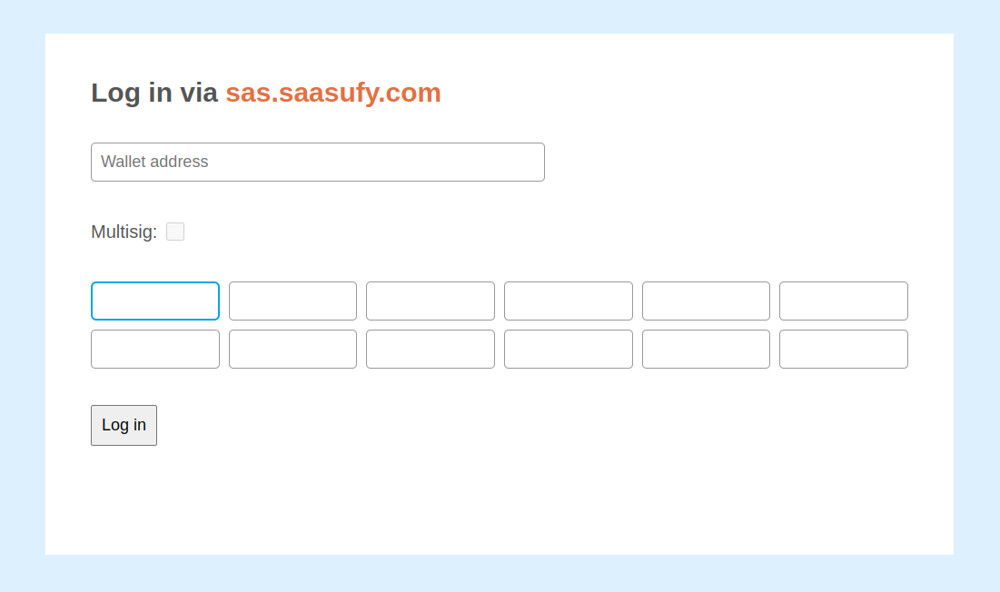

# capitalisk-auth-client
A modular front end toolkit for easily implementing log in using any Capitalisk/LDPoS blockchain.



## What is this for?

This project provides front end components to allow you to easily extend your app or website to support authentication (log in) via a Capitalisk-based blockchain.
It's an alternative to the standard email-based authentication which is currently supported by most websites and it saves you from having to do the work of setting up a registration page and handling the whole sign up and email verification flow.

The main login form component (`capitalisk-log-in`) can be configured to support authentication via any blockchain built using `ldpos-chain` (Capitalisk's consensus engine).

This project is intended to be used with `capitalisk-auth-server` (https://github.com/Capitalisk/capitalisk-auth-server) on the server side (Node.js) to complete the authentication flow. Aside from that, it is highly versatile and can work with any transport protocol (I.e. HTTP/HTTPS and WebSockets) and any API framework on the back end (I.e. ExpressJS, Koa... or without any framework).

## How does it work?

The main front end component is `capitalisk-log-in`; it's a form which allows your end users to authenticate themselves using an account from a Capitalisk-based blockchain.
If a user wants to log into your service via the `capitalisk-log-in` form, they simply need to create a new wallet on the relevant blockchain, obtain a few tokens (you can configure the minimum requirement) and then they will use their account passphrase to log into your service. The minimum token requirement serves as a spam prevention mechanism because users have to spend real money to obtain tokens.

The authentication mechanism does not store any credentials (only keeps them in memory while the authentication handshake is taking place).
Credentials are transferred only between your end users and your own back end server; your server connects to a third-party blockchain node only to obtain the account's public key (which is publicly visible). You can configure the service to connect to any compatible blockchain node of your choice and can even self-host the blockchain node yourself.

## Is it secure?

There are two different security levels: `sig` and `multisig`.

The standard `sig` authentication is the simplest to set up and requires your users to trust you with the main passphrase of their blockchain account.
In this situation, it's important that your users keep a separate account just for your service and don't put more tokens on it than they are willing to trust you with.
As a service provider, you should not store your users' passphrases; for the same reason that you should not store plain text passwords or credit card numbers.

The `multisig` authentication approach provides additional security because your users do not need to trust you with their account's main passphrase or any of the tokens inside it.
On Capitalisk-based blockchains, any account can register a `multisig` passphrase; this passphrase can be used to sign certain multi-party transactions but it can also be used for other purposes. The advantage of this `multisig` key is that it cannot be used to move any funds from the user's account, yet it still allows the user to prove their ownership of the wallet address.

Note also, that Capitalisk-based blockchains, unlike most other blockchains, allow users to change their `sig` and `multisig` passphrases at any time for a small fee for peace of mind.

## Will this work with my app or website?

All included front end components are native Web Components for maximum compatibility; this means that they can work with any framework or no framework.
While these components are fully functional, they do not include any CSS/styling by default so they can be styled to match the look and feel of your own website or application.

## Usage

Include the `capitalisk-log-in` component (full bundle containing all necessary dependencies) into your application (for example):

```js
import '/node_modules/capitalisk-auth-client/dist/capitalisk-log-in.js';
```

Or for a web page, you can put this inside the `<head></head>` tag:

```html
<script src="/node_modules/capitalisk-auth-client/dist/capitalisk-log-in.js" type="module" async></script>
```

This will allow you to add one or more custom `capitalisk-log-in` elements into your web page or app like this:

```html
  <capitalisk-log-in
    hostname="capitalisk.com"
    port="443"
    network-symbol="clsk"
    chain-module-name="capitalisk_chain"
    secure="true"
    wallet-address-length="44"
  ></capitalisk-log-in>
```

This example above sets up a form for authentication via the main Capitalisk blockchain. If you're running your own Capitalisk node, you could point to it instead simply by changing the `hostname` and/or `port` attributes.

Setting up a log in form for any other Capitalisk-based blockchain is just as simple.
For example, the log in form for the saasufy.com (SAS) blockchain is:

```html
  <capitalisk-log-in
    hostname="sas.saasufy.com"
    port="443"
    network-symbol="sas"
    chain-module-name="sas_chain"
    secure="true"
    wallet-address-length="43"
  ></capitalisk-log-in>
```
